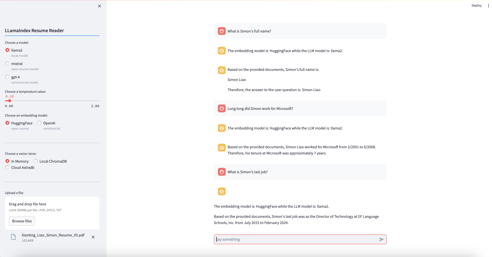

# miniature-spoon
Showcase my personal small LLM projects

A: In the llamaindex-client, these concepts are practiced:

1. RAG with llama-index framework;
2. Three types of LLM models by using ollama and openai: local open source, cloud open source and cloud commercial;
3. Two types of embdedding models bwtween open source (by HuggingFace) and OpenAI;
4. Three types of vector stores: in memory, local ChromaDB and cloud AstraDB.

<!-- B: In the langchain-client, these concepts are used: -->